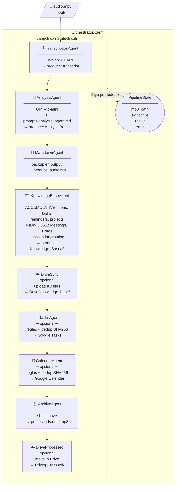
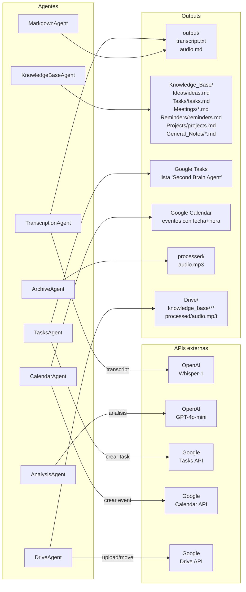

# Diagrama de arquitectura — Second Brain Agent

---

## Vista 1 — Flujo completo del pipeline



---

## Vista 2 — Agentes, APIs y outputs



---

## Vista 3 — Reglas de enrutado de contenido

```mermaid
flowchart TD
    AR[/"AnalysisResult\ncategory + tasks\n+ reminders + ideas"/]

    AR --> CAT{¿Categoría?}

    CAT -->|Idea| IDEA["ideas.md\n(acumulativo)"]
    CAT -->|Tarea| TASK["tasks.md\n(acumulativo)"]
    CAT -->|Recordatorio| REM["reminders.md\n(acumulativo)"]
    CAT -->|Proyecto| PROJ["projects.md\n(acumulativo)"]
    CAT -->|Reunión| MTG["Meetings/\nYYYY-MM-DD_titulo.md\n(individual, secciones ricas)"]
    CAT -->|Nota general| NOTE["General_Notes/\nYYYY-MM-DD_titulo.md\n(individual)"]

    MTG --> SEC{Elementos secundarios}
    NOTE --> SEC

    SEC -->|tasks[]| TASK
    SEC -->|reminders[]| REM
    SEC -->|ideas[]| IDEA

    TASK --> TRULE{Regla de tarea}
    REM --> RRULE{Regla de recordatorio}

    TRULE -->|sin fecha| GTASK7["Google Task\ndue: hoy +7 días"]
    TRULE -->|con fecha| GTASKD["Google Task\ndue: fecha indicada"]
    TRULE -->|ambiguo| MDONLY1["Solo Markdown"]

    RRULE -->|candidato: Google Tasks| GTASKR["Google Task\ncon due date"]
    RRULE -->|candidato: Google Calendar| GCAL["Google Calendar\nevento 1h"]
    RRULE -->|ambiguo / sin marcador| MDONLY2["Solo Markdown"]
```

---

## Leyenda

| Símbolo | Significado |
|---------|-------------|
| `─ opcional ─` | Solo se ejecuta si las credenciales de Google están configuradas |
| `→ PipelineState` | El estado fluye entre todos los nodos de LangGraph |
| `SHA256 dedup` | Antes de crear, se verifica si ya existe en `created_tasks.json` / `created_events.json` |
| `ACCUMULATIVE` | Varias entradas en un solo archivo (ideas.md, tasks.md) |
| `INDIVIDUAL` | Un archivo por entrada (Meetings/, General_Notes/) |

## Conceptos relacionados

- [[31_langgraph_pipeline]] — los 9 nodos en detalle
- [[25_knowledge_base]] — ACCUMULATIVE vs INDIVIDUAL
- [[27_reglas_calendario_tareas]] — la tabla de reglas de enrutado
- [[21_arquitectura_agentes]] — responsabilidad de cada agente
